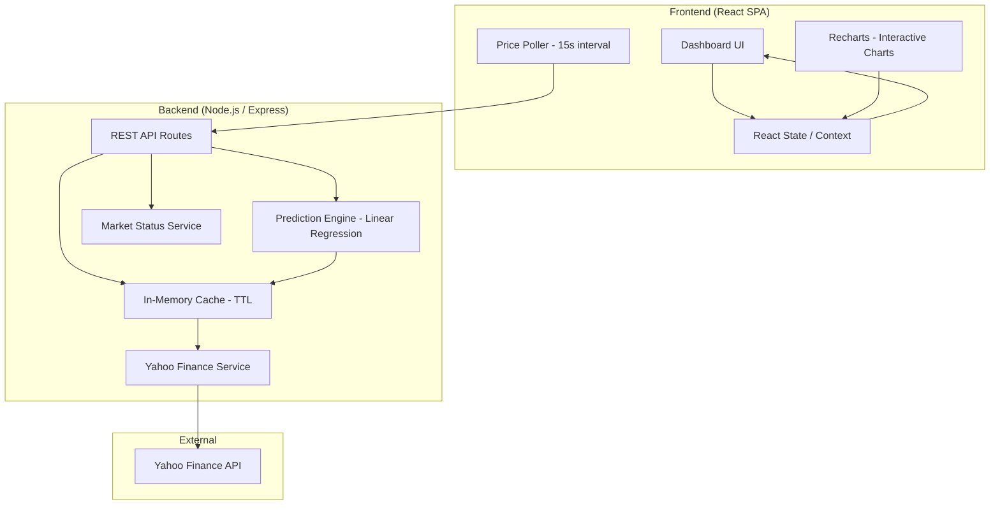
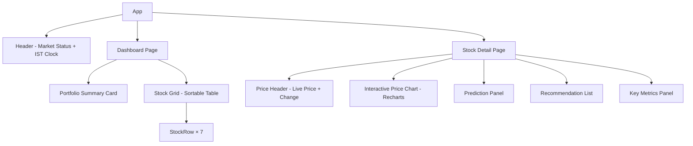

# Design Document: Stock Portfolio Dashboard

## Overview

This design describes a real-time Indian stock market portfolio dashboard built as a full-stack web application. The system uses a Node.js/Express backend that proxies Yahoo Finance data via the `yahoo-finance2` npm package, and a React frontend that renders live prices, historical charts, price predictions, and analyst recommendations for 7 curated Indian securities.

The backend acts as a thin API layer — fetching, caching, and transforming Yahoo Finance data — while the frontend handles real-time polling, interactive charting, and responsive layout. Price predictions are computed server-side using a simple linear regression model over historical closing prices.

### Key Design Decisions

1. **Yahoo Finance via `yahoo-finance2`**: No API key required. Provides real-time quotes (~15 min delay), historical OHLCV data, and analyst recommendations for `.NS` suffixed Indian tickers.
2. **Polling over WebSockets**: The frontend polls the backend at 15-second intervals during market hours. This is simpler than WebSockets and aligns with Yahoo Finance's data refresh rate.
3. **Server-side caching**: An in-memory cache with TTL prevents excessive Yahoo Finance requests and improves response times.
4. **Linear regression for predictions**: A lightweight approach using historical closing prices. Predictions are generated once daily after market close and cached until the next trading day.
5. **Chrome-only target**: No cross-browser compatibility concerns. We can use modern CSS (container queries, `gap`) and JS APIs freely.

## Architecture



### Request Flow

1. Frontend `Poller` sends GET requests to backend REST API every 15 seconds during market hours.
2. Backend checks `Cache` — if data is fresh (within TTL), returns cached response.
3. If cache miss, `YFService` calls `yahoo-finance2` methods (`quote`, `chart`, `quoteSummary`).
4. Response is cached, transformed, and returned to frontend.
5. Frontend updates `State` (React Context), triggering re-renders with price change animations.

## Components and Interfaces

### Backend Components

#### 1. REST API Routes (`/api`)

| Endpoint | Method | Description |
|---|---|---|
| `/api/quotes` | GET | Returns real-time quotes for all 7 securities |
| `/api/quotes/:symbol` | GET | Returns real-time quote for a single security |
| `/api/historical/:symbol` | GET | Returns historical OHLCV data. Query params: `range` (1d, 1w, 1mo, 3mo, 6mo, 1y) |
| `/api/predictions/:symbol` | GET | Returns price predictions (1w, 1mo, 3mo) with confidence levels |
| `/api/recommendations/:symbol` | GET | Returns analyst recommendations and consensus rating |
| `/api/market-status` | GET | Returns current NSE market status and IST time |
| `/api/summary/:symbol` | GET | Returns detailed financial metrics (52w high/low, market cap, P/E, dividend yield) |

#### 2. Yahoo Finance Service (`YFService`)

Wraps `yahoo-finance2` methods and normalizes responses:

```typescript
interface YFService {
  getQuotes(symbols: string[]): Promise<QuoteData[]>;
  getHistorical(symbol: string, range: TimeRange): Promise<HistoricalDataPoint[]>;
  getRecommendations(symbol: string): Promise<RecommendationData>;
  getQuoteSummary(symbol: string): Promise<SummaryData>;
}
```

**yahoo-finance2 methods used:**
- `quote(symbols)` — real-time price, volume, day high/low, change
- `chart(symbol, { period1, period2, interval })` — historical OHLCV for charts
- `quoteSummary(symbol, { modules: ['recommendationTrend', 'financialData', 'defaultKeyStatistics'] })` — analyst recommendations, financial metrics

#### 3. Cache Service

```typescript
interface CacheService {
  get<T>(key: string): T | null;
  set<T>(key: string, value: T, ttlSeconds: number): void;
  invalidate(key: string): void;
  invalidateAll(): void;
}
```

**TTL Strategy:**
| Data Type | TTL | Rationale |
|---|---|---|
| Real-time quotes | 10 seconds | Slightly under poll interval to ensure fresh data |
| Historical data | 1 hour | Changes infrequently intraday |
| Predictions | Until next market close | Computed once daily |
| Recommendations | 6 hours | Updated once per trading day |
| Market status | 30 seconds | Needs to reflect open/close transitions |

#### 4. Prediction Engine

Uses simple linear regression on historical closing prices to project future prices.

```typescript
interface PredictionEngine {
  generatePredictions(symbol: string, historicalData: HistoricalDataPoint[]): PredictionSet;
}

interface PredictionSet {
  symbol: string;
  generatedAt: string; // ISO timestamp
  predictions: {
    horizon: '1w' | '1mo' | '3mo';
    predictedPrice: number;
    confidence: number; // 0-100
    direction: 'up' | 'down' | 'neutral';
  }[];
}
```

**Prediction approach:**
- Fit a linear regression line to the last 6 months of daily closing prices.
- Extrapolate to 1 week, 1 month, and 3 months.
- Confidence is derived from R² (coefficient of determination) of the regression, scaled to 0–100.
- Lower R² → lower confidence. Predictions with R² < 0.1 get a confidence floor of 10%.

#### 5. Market Status Service

Determines NSE market status based on current IST time and a static holiday calendar.

```typescript
interface MarketStatusService {
  getStatus(): MarketStatus;
  isMarketOpen(): boolean;
}

interface MarketStatus {
  status: 'pre-market' | 'open' | 'closed' | 'post-market';
  currentTimeIST: string;
  nextOpenTime?: string;
  nextCloseTime?: string;
}
```

**Rules:**
- Pre-market: 9:00 AM – 9:15 AM IST on trading days
- Open: 9:15 AM – 3:30 PM IST on trading days
- Post-market: 3:30 PM – 4:00 PM IST on trading days
- Closed: all other times, weekends, and NSE holidays

### Frontend Components

#### 1. App Shell & Routing

```
/ → Dashboard (portfolio overview + price grid)
/stock/:symbol → Stock Detail View
```

Uses React Router for navigation. App shell includes a persistent header with market status indicator and IST clock.

#### 2. Component Hierarchy



#### 3. Key Frontend Interfaces

```typescript
// Polling hook
function useStockPoller(intervalMs: number): {
  quotes: QuoteData[];
  isLoading: boolean;
  error: string | null;
  lastUpdated: Date | null;
  isConnected: boolean;
  refresh: () => void;
};

// Portfolio context
interface PortfolioContextValue {
  quotes: Map<string, QuoteData>;
  marketStatus: MarketStatus;
  isConnected: boolean;
  lastUpdated: Date | null;
  refreshAll: () => void;
}
```

#### 4. Price Change Animation

When a quote updates, the `StockRow` component compares the new price to the previous price:
- Price up → brief green background flash + green text
- Price down → brief red background flash + red text
- No change → no animation

Implemented via CSS transitions with a 600ms duration class toggled on price change.

## Data Models

### QuoteData

```typescript
interface QuoteData {
  symbol: string;           // e.g. "RELIANCE.NS"
  shortName: string;        // e.g. "Reliance Industries"
  price: number;            // Current/last price in INR
  previousClose: number;    // Previous day's closing price
  change: number;           // Absolute price change
  changePercent: number;    // Percentage price change
  dayHigh: number;
  dayLow: number;
  volume: number;
  marketState: string;      // "REGULAR", "CLOSED", "PRE", "POST"
  lastUpdated: string;      // ISO timestamp of last successful fetch
}
```

### HistoricalDataPoint

```typescript
interface HistoricalDataPoint {
  date: string;    // ISO date string
  open: number;
  high: number;
  low: number;
  close: number;
  volume: number;
}
```

### PredictionData

```typescript
interface PredictionData {
  symbol: string;
  generatedAt: string;
  disclaimer: string;
  predictions: {
    horizon: '1w' | '1mo' | '3mo';
    predictedPrice: number;
    confidence: number;       // 0-100
    currentPrice: number;
    priceChange: number;
    priceChangePercent: number;
    direction: 'up' | 'down' | 'neutral';
  }[];
}
```

### RecommendationData

```typescript
interface RecommendationData {
  symbol: string;
  consensusRating: 'Strong Buy' | 'Buy' | 'Hold' | 'Sell' | 'Strong Sell';
  consensusScore: number;     // 1.0 (Strong Sell) to 5.0 (Strong Buy)
  totalAnalysts: number;
  recommendations: {
    firm: string;
    rating: 'Buy' | 'Hold' | 'Sell' | 'Strong Buy' | 'Strong Sell';
    targetPrice: number;
    date: string;             // ISO date
  }[];
}
```

### PortfolioSummary

```typescript
interface PortfolioSummary {
  totalValue: number;
  totalDailyChange: number;
  totalDailyChangePercent: number;
  securitiesCount: number;
  lastUpdated: string;
}
```

### Supported Securities Configuration

```typescript
const SUPPORTED_SECURITIES = [
  { symbol: 'RELIANCE.NS', name: 'Reliance Industries', sector: 'Energy' },
  { symbol: 'HDFCBANK.NS', name: 'HDFC Bank', sector: 'Banking' },
  { symbol: 'SBIN.NS', name: 'State Bank of India', sector: 'Banking' },
  { symbol: 'HAL.NS', name: 'Hindustan Aeronautics', sector: 'Defence' },
  { symbol: 'BHARTIARTL.NS', name: 'Bharti Airtel', sector: 'Telecom' },
  { symbol: 'NIFTYBEES.NS', name: 'Nippon India Nifty BeES', sector: 'ETF' },
  { symbol: 'GOLDBEES.NS', name: 'Nippon India Gold BeES', sector: 'ETF' },
] as const;
```


## Correctness Properties

*A property is a characteristic or behavior that should hold true across all valid executions of a system — essentially, a formal statement about what the system should do. Properties serve as the bridge between human-readable specifications and machine-verifiable correctness guarantees.*

### Property 1: Quote data rendering completeness

*For any* valid `QuoteData` object with arbitrary numeric values for price, change, changePercent, dayHigh, dayLow, and volume, the rendered stock row output SHALL contain all six data points: current price, price change (absolute), price change (percentage), day high, day low, and volume.

**Validates: Requirements 1.3**

### Property 2: Price direction indicator correctness

*For any* pair of (previousClose, currentPrice) where both are positive numbers, the price change visual indicator SHALL apply the "up" style (green) when currentPrice > previousClose, the "down" style (red) when currentPrice < previousClose, and a neutral style when they are equal.

**Validates: Requirements 1.4**

### Property 3: Portfolio summary computation

*For any* non-empty array of `QuoteData` objects with arbitrary positive prices and change values, the computed `PortfolioSummary` SHALL satisfy: `totalValue` equals the sum of all individual prices, `totalDailyChange` equals the sum of all individual change values, `totalDailyChangePercent` equals `(totalDailyChange / (totalValue - totalDailyChange)) * 100`, and `securitiesCount` equals the length of the input array.

**Validates: Requirements 2.1**

### Property 4: Securities list sorting correctness

*For any* array of `QuoteData` objects and any valid sort field (name, price, dailyChangePercent, volume) with any sort direction (ascending or descending), the sorted output SHALL be correctly ordered such that for every consecutive pair of elements, the sort field value of the first element is ≤ (ascending) or ≥ (descending) the sort field value of the second element.

**Validates: Requirements 2.3**

### Property 5: Prediction engine output invariants

*For any* valid array of at least 30 historical closing prices, the prediction engine SHALL produce exactly 3 predictions with horizons '1w', '1mo', and '3mo', and each prediction's confidence value SHALL be a number between 0 and 100 inclusive.

**Validates: Requirements 3.1, 3.2**

### Property 6: Recommendation rendering completeness

*For any* valid `RecommendationData` object containing an array of recommendations, each rendered recommendation entry SHALL display the firm name, rating type, target price, and date.

**Validates: Requirements 4.2**

### Property 7: Consensus rating computation

*For any* non-empty array of analyst recommendations with ratings from the set {Strong Buy, Buy, Hold, Sell, Strong Sell}, the computed consensus rating SHALL equal the rating category corresponding to the rounded average of the numeric scores (Strong Buy=5, Buy=4, Hold=3, Sell=2, Strong Sell=1), and the consensus score SHALL be the arithmetic mean of all individual numeric scores.

**Validates: Requirements 4.3**

### Property 8: Recommendations sorted by date descending

*For any* array of recommendation objects with arbitrary valid dates, the sorted output SHALL be ordered such that for every consecutive pair, the first recommendation's date is greater than or equal to the second recommendation's date.

**Validates: Requirements 4.4**

### Property 9: Financial metrics rendering completeness

*For any* valid `SummaryData` object with arbitrary numeric values, the rendered metrics panel SHALL contain all five key metrics: 52-week high, 52-week low, market capitalization, P/E ratio, and dividend yield.

**Validates: Requirements 5.3**

### Property 10: Market status determination

*For any* IST timestamp on a non-holiday weekday, the market status service SHALL return 'pre-market' for times between 9:00 AM and 9:15 AM, 'open' for times between 9:15 AM and 3:30 PM, 'post-market' for times between 3:30 PM and 4:00 PM, and 'closed' for all other times. For weekends and holidays, the status SHALL always be 'closed'.

**Validates: Requirements 6.1**

## Error Handling

### Backend Error Handling

| Error Scenario | Handling Strategy |
|---|---|
| Yahoo Finance API timeout/failure | Return cached data if available; otherwise return `{ error: 'DATA_UNAVAILABLE', symbol }` with HTTP 503. Retry on next poll cycle. |
| Invalid symbol requested | Return HTTP 400 with `{ error: 'INVALID_SYMBOL', message }`. Only allow symbols from `SUPPORTED_SECURITIES`. |
| Prediction engine failure (insufficient data) | Return `{ error: 'PREDICTION_UNAVAILABLE', symbol }` with HTTP 200 (partial success). Log error for review. |
| Rate limiting from Yahoo Finance | Exponential backoff starting at 1 second, max 60 seconds. Serve cached data during backoff. |
| Server startup failure | Log error and exit with non-zero code. Health check endpoint `/api/health` returns 503. |

### Frontend Error Handling

| Error Scenario | Handling Strategy |
|---|---|
| Network connectivity loss | Display "Connection Lost" banner. Retain last known prices with stale indicator (dimmed opacity + "stale" badge). Continue polling — requests will fail silently until connectivity returns. |
| Network connectivity restored | Remove banner, resume normal polling. Force immediate refresh on reconnection. |
| API returns error for a specific security | Display "Data Unavailable" for that security. Other securities continue updating normally. |
| API returns error for predictions | Display "Prediction Unavailable" in the prediction panel. |
| API returns error for recommendations | Display "No Analyst Recommendations Available". |
| Manual refresh failure | Show brief toast notification "Refresh failed. Retrying..." and auto-retry once after 5 seconds. |

### Connectivity Detection

The frontend uses `navigator.onLine` combined with polling failure detection:
1. Listen to `window.online` and `window.offline` events for immediate detection.
2. If 3 consecutive poll requests fail, treat as disconnected regardless of `navigator.onLine`.
3. On reconnection, wait 2 seconds then force a full data refresh.

## Testing Strategy

### Unit Tests

Unit tests cover specific examples, edge cases, and error conditions:

- **Cache Service**: Test TTL expiration, cache hit/miss, invalidation.
- **Market Status Service**: Test boundary times (9:14 AM → pre-market, 9:15 AM → open, 3:30 PM → post-market), weekends, holidays.
- **Prediction Engine**: Test with known data sets where expected output can be manually calculated. Test edge cases: insufficient data, flat prices, extreme volatility.
- **Consensus Rating**: Test specific rating distributions (all Buy, mixed, all Sell).
- **Portfolio Summary**: Test with known price sets, verify arithmetic.
- **API Routes**: Test request validation, error responses, correct HTTP status codes.
- **Frontend Components**: Test rendering of individual components with mock data. Test error states and loading states.

### Property-Based Tests

Property-based tests verify universal properties across randomly generated inputs. Each property test runs a minimum of 100 iterations.

**Library**: `fast-check` (JavaScript/TypeScript property-based testing library)

**Tests to implement** (one per correctness property):

1. **Feature: stock-portfolio-dashboard, Property 1: Quote data rendering completeness** — Generate random QuoteData, verify all 6 fields rendered.
2. **Feature: stock-portfolio-dashboard, Property 2: Price direction indicator correctness** — Generate random price pairs, verify correct CSS class.
3. **Feature: stock-portfolio-dashboard, Property 3: Portfolio summary computation** — Generate random QuoteData arrays, verify arithmetic invariants.
4. **Feature: stock-portfolio-dashboard, Property 4: Securities list sorting correctness** — Generate random arrays + sort config, verify ordering.
5. **Feature: stock-portfolio-dashboard, Property 5: Prediction engine output invariants** — Generate random historical price arrays, verify 3 horizons + confidence bounds.
6. **Feature: stock-portfolio-dashboard, Property 6: Recommendation rendering completeness** — Generate random recommendations, verify all fields rendered.
7. **Feature: stock-portfolio-dashboard, Property 7: Consensus rating computation** — Generate random rating arrays, verify weighted average correctness.
8. **Feature: stock-portfolio-dashboard, Property 8: Recommendations sorted by date descending** — Generate random dated recommendations, verify sort order.
9. **Feature: stock-portfolio-dashboard, Property 9: Financial metrics rendering completeness** — Generate random SummaryData, verify all 5 metrics rendered.
10. **Feature: stock-portfolio-dashboard, Property 10: Market status determination** — Generate random IST timestamps, verify status matches time-based rules.

### Integration Tests

- **Yahoo Finance Service**: Test actual API calls to Yahoo Finance for each supported ticker (run sparingly, not in CI).
- **API Endpoints**: Test full request/response cycle with mocked Yahoo Finance service.
- **Polling Behavior**: Test that the frontend poller fires at correct intervals and handles failures gracefully.
- **Connectivity Recovery**: Test the full disconnect → reconnect → resume flow.

### End-to-End Tests

- **Dashboard Load**: Verify all 7 securities display with price data on initial load.
- **Navigation**: Verify clicking a security navigates to detail view with all sections.
- **Responsive Layout**: Verify layout at 320px, 768px, and 1024px breakpoints.
